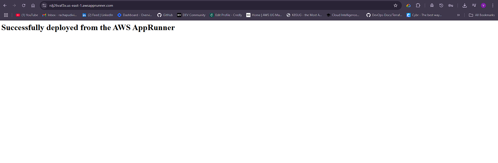

# AWS App Runner Demo

Simple Node.js TypeScript application for testing AWS App Runner deployment.

## Getting Started

1. Clone this repository:
```bash
git clone https://github.com/aquavis12/aws-apprunner-demo
cd aws-apprunner-demo
```

2. Install dependencies and run locally:
```bash
npm install
npm run dev
```


## Deployment

This app is configured for AWS App Runner with `apprunner.yaml`. It will automatically build and deploy when connected to your repository.

## What it does

Serves a simple HTML page confirming successful AWS App Runner deployment.

## Demo Videos

### Pre-Deployment
<video width="600" controls>
  <source src="https://apprunner-demo-videos-2025.s3.us-east-1.amazonaws.com/app-runner-demo.mp4" type="video/mp4">
  [📹 Download Demo Video - Setup and Configuration](https://apprunner-demo-videos-2025.s3.us-east-1.amazonaws.com/app-runner-demo.mp4)
</video>

### Post-Deployment
<video width="600" controls>
  <source src="https://apprunner-demo-videos-2025.s3.us-east-1.amazonaws.com/app-runner-demo-1.mp4" type="video/mp4">
  [📹 Download Demo Video - Running Application](https://apprunner-demo-videos-2025.s3.us-east-1.amazonaws.com/app-runner-demo-1.mp4)
</video>



### Blog Post
[📖 AWS App Runner: The Easiest Way to Deploy Containers to the Cloud](https://dev.to/aws-builders/aws-app-runner-the-easiest-way-to-deploy-containers-to-the-cloud-5fbf)